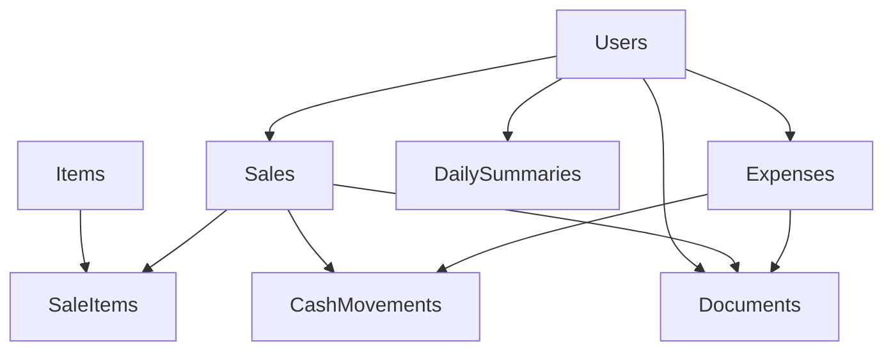

# Import System Konzept

## 📋 Übersicht

Dieses Dokument beschreibt das Konzept für ein umfassendes Import-System für das POS-LIA-HAIR System. Das Import-System soll sowohl für den initialen Datenimport bei der Systemeinführung als auch für die Erstellung von Testdaten während der Entwicklung verwendet werden.

## 🎯 Ziele

1. **Initial Data Import**: Import historischer Transaktionsdaten beim Go-Live
2. **Development Support**: Schnelle Generierung von Testdaten für die Entwicklung
3. **Data Migration**: Vereinfachung zukünftiger Datenmigrationen
4. **Backup/Restore**: Grundlage für Backup- und Restore-Funktionen

## 📊 Aktuelle Situation

### System-Architektur
Das POS-System basiert auf 8 Hauptentitäten mit komplexen Abhängigkeiten:



### Datenmodell Details

#### Core Entities
- **Users**: Benutzer (admin/staff)
- **Items**: Produkte/Dienstleistungen
- **Sales**: Verkäufe mit Payment Methods (cash/twint/sumup)
- **Sale_Items**: Verkaufs-Details (Produkte pro Verkauf)
- **Expenses**: Ausgaben mit Categories (rent/supplies/salary/utilities/insurance/other)

#### Financial Tracking
- **Cash_Movements**: Automatische Kassenbuch-Einträge
- **Daily_Summaries**: Tagesabschlüsse (automatisch berechnet)
- **Monthly_Summaries**: Monatsabschlüsse (mit Validierung)

#### Document Management
- **Documents**: PDF-Belege in Supabase Storage
- Automatische Receipt-Generierung für alle Sales
- Obligatorische Receipt-Uploads für alle Expenses

### Kritische Abhängigkeiten

#### 1. User ID Dependencies
```sql
-- Alle Haupttabellen sind user_id-abhängig
sales.user_id UUID REFERENCES users(id) NOT NULL
expenses.user_id UUID REFERENCES users(id) NOT NULL
documents.user_id UUID REFERENCES users(id) NOT NULL
daily_summaries.user_id UUID REFERENCES users(id) NOT NULL
```

#### 2. Cash Movement Integration
```sql
-- Jede Cash-Transaktion erzeugt automatisch Cash Movement
CREATE TABLE cash_movements (
    reference_type TEXT CHECK (reference_type IN ('sale', 'expense', 'adjustment')),
    reference_id UUID -- Verweist auf sales.id oder expenses.id
);
```

#### 3. Document Requirements
- Jeder Sale → automatische Receipt-PDF-Generierung
- Jede Expense → obligatorischer Receipt-Upload
- Alle PDFs in Supabase Storage (`documents` Bucket)

#### 4. Daily Summary Calculation
```sql
-- Automatische Berechnung basierend auf Sales/Expenses
FUNCTION calculate_daily_summary(summary_date DATE)
-- Abhängig von: Sales, Expenses, manueller cash_starting/cash_ending
```

### Row Level Security (RLS)
```sql
-- Sehr permissive Policies (Single-User System)
CREATE POLICY "expenses_all_access" ON expenses 
FOR ALL TO authenticated USING (true) WITH CHECK (true);
```

## 🚀 Gewünschte Import-Funktionalität

### UI Integration

#### Settings Page Struktur
```
/settings/
├── import/          # Import-Funktionen
│   ├── historical/  # Historische Daten (Go-Live)
│   ├── test-data/   # Testdaten-Generierung
│   └── templates/   # Import-Templates
├── business/        # Geschäftseinstellungen  
├── users/          # Benutzerverwaltung (admin only)
├── backup/         # Export/Backup Funktionen
└── system/         # System-Einstellungen
```

#### Navigation Integration
```typescript
const navItems = [
  // ... existing items
  { 
    name: "Einstellungen", 
    href: "/settings", 
    icon: Settings, 
    adminOnly: true 
  }
]
```

### Import-Formate

#### 1. JSON Format (Entwicklung)
```json
{
  "metadata": {
    "version": "1.0",
    "created_at": "2025-01-27T12:00:00Z",
    "description": "Testdaten für POS System",
    "import_config": {
      "target_user_id": "current",
      "batch_size": 100,
      "generate_receipts": true,
      "validate_only": false,
      "overwrite_duplicates": false
    }
  },
  "cash_balance": {
    "starting_date": "2025-01-01",
    "starting_amount": 500.00,
    "description": "Anfangsbestand bei Systemstart"
  },
  "users": [
    {
      "name": "Test Staff",
      "username": "staff1",
      "email": "staff@example.com",
      "role": "staff"
    }
  ],
  "items": [
    {
      "name": "Haarschnitt Damen",
      "default_price": 65.00,
      "type": "service",
      "is_favorite": true,
      "active": true
    }
  ],
  "sales": [
    {
      "date": "2025-01-15",
      "time": "10:30",
      "total_amount": 65.00,
      "payment_method": "cash",
      "status": "completed",
      "items": [
        {
          "item_name": "Haarschnitt Damen",
          "price": 65.00,
          "notes": "Stammkundin"
        }
      ],
      "notes": "Regulärer Termin"
    }
  ],
  "expenses": [
    {
      "date": "2025-01-15",
      "amount": 120.00,
      "description": "Shampoo Nachbestellung",
      "category": "supplies",
      "payment_method": "bank",
      "supplier_name": "Beauty Supply AG",
      "invoice_number": "INV-2025-001",
      "notes": "Monatliche Bestellung"
    }
  ]
}
```

#### 2. CSV Format (Einfache Daten)
Separate CSV-Dateien für jede Entität:
- `items.csv` - Produkte/Services
- `sales.csv` - Verkaufstransaktionen  
- `expenses.csv` - Ausgaben
- `cash_adjustments.csv` - Manuelle Kassen-Korrekturen

#### 3. Excel Format (Business Users)
Multi-Sheet Excel-Datei mit vorgefertigten Templates:
- Sheet "Items" - Produkt-Katalog
- Sheet "Sales" - Verkaufs-Historie
- Sheet "Expenses" - Ausgaben-Historie
- Sheet "Settings" - Import-Konfiguration

### Import-Architektur

#### Hook Pattern
```typescript
// lib/hooks/business/useImport.ts
interface ImportConfig {
  validateOnly: boolean          // Dry-run Modus
  batchSize: number             // Records pro Batch  
  targetUserId: string          // User für historische Daten
  generateMissingReceipts: boolean // Dummy PDFs für Expenses
  skipCashMovements: boolean    // Falls manuell verwaltet
  overwriteExisting: boolean    // Duplikat-Behandlung
}

interface ImportState {
  status: 'idle' | 'processing' | 'success' | 'error'
  progress: number
  currentPhase: string
  results: ImportResults | null
  errors: string[]
}

const useImport = () => {
  const [state, setState] = useState<ImportState>()
  
  const processImport = async (
    type: ImportType, 
    data: any, 
    config: ImportConfig
  ) => {
    // Implementation
  }
  
  return { state, processImport }
}
```

#### Import-Phasen
```typescript
enum ImportPhase {
  VALIDATION = 'validation',
  DEPENDENCY_RESOLUTION = 'dependency_resolution', 
  DATA_IMPORT = 'data_import',
  CASH_MOVEMENT_GENERATION = 'cash_movement_generation',
  DOCUMENT_GENERATION = 'document_generation',
  SUMMARY_RECALCULATION = 'summary_recalculation'
}

const IMPORT_ORDER = [
  'users',           // Zuerst (für user_id references)
  'items',           // Dann (für sale_items references)  
  'sales',           // Dann (für cash_movements references)
  'sale_items',      // Parallel zu sales
  'expenses',        // Dann (für cash_movements references)
  'cash_movements',  // Nach sales/expenses (automatisch generiert)
  'documents',       // Nach allem (für file uploads)
  'daily_summaries'  // Zum Schluss (recalculate)
]
```

#### Validierungs-Regeln
```typescript
const validation = {
  items: {
    required: ['name', 'default_price', 'type'],
    rules: {
      type: ['service', 'product'],
      default_price: 'positive number',
      name: 'unique within import'
    }
  },
  sales: {
    required: ['date', 'total_amount', 'payment_method', 'items'],
    rules: {
      payment_method: ['cash', 'twint', 'sumup'],
      items: 'must reference existing items',
      total_amount: 'must equal sum of item prices',
      date: 'not in future, valid swiss timezone'
    }
  },
  expenses: {
    required: ['date', 'amount', 'description', 'category', 'payment_method'],
    rules: {
      category: ['rent', 'supplies', 'salary', 'utilities', 'insurance', 'other'],
      payment_method: ['bank', 'cash'],
      amount: 'positive number',
      date: 'not in future'
    }
  }
}
```

#### Transaction Safety
```typescript
const importWithRollback = async (data: ImportData, config: ImportConfig) => {
  const supabase = createClient()
  
  try {
    // Start transaction (falls möglich mit Supabase)
    await supabase.rpc('begin_import_transaction')
    
    // Import phases
    for (const phase of IMPORT_PHASES) {
      await processPhase(phase, data, config)
      updateProgress((phase.index / IMPORT_PHASES.length) * 100)
    }
    
    // Commit if all successful
    await supabase.rpc('commit_import_transaction')
    
  } catch (error) {
    // Rollback on any error
    await supabase.rpc('rollback_import_transaction')
    throw error
  }
}
```

### Kritische Implementierungs-Aspekte

#### 1. Cash Movement Auto-Generation
```typescript
const generateCashMovements = async (sales: Sale[], expenses: Expense[]) => {
  const movements = []
  
  // Cash Sales → Cash In
  for (const sale of sales.filter(s => s.payment_method === 'cash')) {
    movements.push({
      amount: sale.total_amount,
      type: 'cash_in',
      description: `Verkauf #${sale.id}`,
      reference_type: 'sale',
      reference_id: sale.id,
      user_id: sale.user_id
    })
  }
  
  // Cash Expenses → Cash Out
  for (const expense of expenses.filter(e => e.payment_method === 'cash')) {
    movements.push({
      amount: expense.amount,
      type: 'cash_out', 
      description: `Ausgabe: ${expense.description}`,
      reference_type: 'expense',
      reference_id: expense.id,
      user_id: expense.user_id
    })
  }
  
  return movements
}
```

#### 2. Document Generation
```typescript
const generateMissingDocuments = async (sales: Sale[], expenses: Expense[]) => {
  // Sales → Receipt PDFs
  for (const sale of sales) {
    const receiptPDF = await generateReceiptPDF(sale)
    await uploadDocument(receiptPDF, 'receipt', sale.id)
  }
  
  // Expenses → Dummy Receipt PDFs (da Upload obligatorisch)
  for (const expense of expenses) {
    const dummyReceiptPDF = await generateDummyExpenseReceiptPDF(expense)
    await uploadDocument(dummyReceiptPDF, 'expense_receipt', expense.id)
  }
}
```

#### 3. Daily Summary Recalculation
```typescript
const recalculateDailySummaries = async (dateRange: DateRange) => {
  for (const date of dateRange) {
    await supabase.rpc('calculate_daily_summary', { summary_date: date })
  }
}
```

## 🔍 User ID Dependencies - Analyse

### Aktuelle Implementierung
Alle Haupttabellen sind strikt `user_id`-abhängig:

```sql
sales.user_id UUID REFERENCES users(id) NOT NULL
expenses.user_id UUID REFERENCES users(id) NOT NULL  
documents.user_id UUID REFERENCES users(id) NOT NULL
daily_summaries.user_id UUID REFERENCES users(id) NOT NULL
```

### Vorteile
✅ **Audit Trail**: Jede Aktion ist einem Benutzer zuordenbar  
✅ **RLS Security**: Row Level Security basiert auf user_id  
✅ **Multi-User Ready**: System kann mehrere Benutzer unterstützen  
✅ **Backup/Restore**: User-spezifische Daten-Exports möglich  

### Nachteile / Probleme
❌ **Import Complexity**: Historische Daten brauchen gültigen user_id  
❌ **Shared Data**: Produkte (Items) sind nicht shared zwischen Usern  
❌ **System Data**: Manche Daten sind eher "System-Daten" als User-Daten  
❌ **Migration Issues**: User-ID-Changes erschweren Datenmigrationen  

### Zukunfts-Probleme

#### 1. Multi-Location Expansion
```sql
-- Problem: Jeder Salon braucht eigene Items?
-- Besser: Shared Item-Catalog + Location-specific pricing
items.user_id → items.location_id
```

#### 2. Shared Resources
```sql
-- Problem: Daily summaries sind user-specific
-- Aber: Ein Tag gehört zum Geschäft, nicht zum User
daily_summaries.user_id → daily_summaries.location_id + daily_summaries.created_by
```

#### 3. System Operations
```sql
-- Problem: Automated tasks brauchen einen user_id
-- Besser: System-User oder nullable user_id für System-Operations
```

### Empfohlene Verbesserungen

#### Option 1: System User Pattern
```sql
-- Erstelle einen System-User für automatisierte Tasks
INSERT INTO users (id, name, username, email, role, is_system)
VALUES ('00000000-0000-0000-0000-000000000000', 'System', 'system', 'system@internal', 'admin', true);
```

#### Option 2: Nullable User IDs + Created By
```sql
-- Für System-Operationen: user_id = NULL, created_by = actual_user
ALTER TABLE daily_summaries ADD COLUMN created_by UUID REFERENCES users(id);
ALTER TABLE daily_summaries ALTER COLUMN user_id DROP NOT NULL;
```

#### Option 3: Entity-Specific Ownership
```sql
-- Items gehören zum System (shared)
ALTER TABLE items DROP COLUMN user_id;

-- Sales gehören zu einem User (wer hat verkauft)
-- Expenses gehören zu einem User (wer hat erfasst)  
-- Daily summaries gehören zum System, haben created_by
```

### Empfehlung für Import
Für das Import-System empfehle ich **Option 1 (System User)**:

1. Erstelle einen dedizierten "Import" oder "System" User
2. Alle importierten historischen Daten bekommen diese user_id
3. Optionales `imported_by` Feld für Audit Trail
4. Später: Migration zu flexiblerer Ownership-Struktur

```sql
-- Import User erstellen
INSERT INTO users (id, name, username, email, role)
VALUES ('99999999-9999-9999-9999-999999999999', 'Data Import', 'import', 'import@internal', 'admin');
```

## 📋 Implementation Roadmap

### Phase 1: Basic Import (MVP)
- [ ] Settings Page Layout
- [ ] Basic JSON Import für Items
- [ ] Validation Framework
- [ ] Import User Creation

### Phase 2: Core Functionality  
- [ ] Sales Import mit Cash Movement Generation
- [ ] Expense Import mit Dummy Receipt Generation
- [ ] Batch Processing
- [ ] Progress Tracking

### Phase 3: Advanced Features
- [ ] CSV/Excel Support
- [ ] Transaction Rollback
- [ ] Duplicate Detection
- [ ] Daily Summary Recalculation

### Phase 4: Production Ready
- [ ] Error Recovery
- [ ] Import History/Audit
- [ ] Template System
- [ ] Performance Optimization

## 🔧 Technical Implementation

### File Structure
```
app/(auth)/settings/
├── page.tsx                    # Settings Overview
├── import/
│   ├── page.tsx               # Import Dashboard  
│   ├── components/
│   │   ├── FileUpload.tsx
│   │   ├── ImportProgress.tsx
│   │   ├── ValidationResults.tsx
│   │   ├── ImportHistory.tsx
│   │   └── ImportConfig.tsx
│   └── utils/
│       ├── importValidation.ts
│       ├── importProcessor.ts
│       ├── documentGenerator.ts
│       └── importTypes.ts
├── business/
│   └── page.tsx               # Business Settings
└── components/
    └── SettingsLayout.tsx     # Shared Layout

lib/hooks/business/
└── useImport.ts               # Import Hook

lib/utils/
├── importValidation.ts        # Validation Logic
├── importProcessor.ts         # Import Processing
└── documentGenerator.ts       # PDF Generation
```

### Dependencies
```json
{
  "dependencies": {
    "@react-pdf/renderer": "^4.3.0",  // Already included
    "pdf-lib": "^1.17.1",             // Already included  
    "papaparse": "^5.4.1",            // CSV parsing
    "xlsx": "^0.18.5"                 // Excel parsing
  }
}
```

## 🎯 Fazit

Das Import-System ist deutlich komplexer als ursprünglich gedacht, aber essentiell für:
1. **Go-Live Success**: Historische Daten müssen importierbar sein
2. **Development Efficiency**: Testdaten-Generierung beschleunigt Entwicklung  
3. **Future-Proofing**: Basis für Backup/Restore und Datenmigrationen

Die `user_id`-Abhängigkeiten sind kurzfristig handhabbar mit einem System-User, sollten aber mittelfristig für bessere Skalierbarkeit überarbeitet werden.

**Empfehlung**: Mit Phase 1 (MVP) starten und iterativ ausbauen.