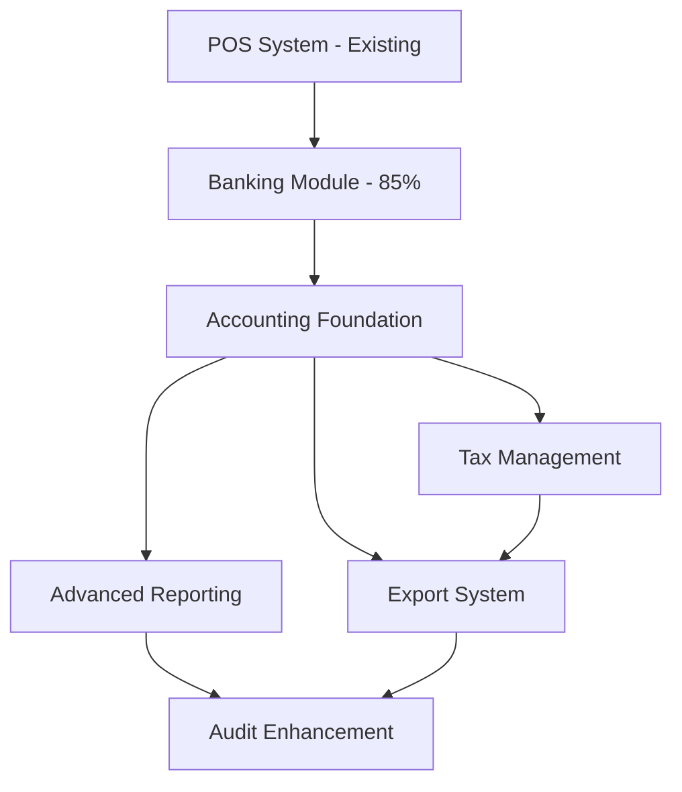

# 📊 Buchhaltung Zukunftskonzept - Vollständiges Schweizer KMU-System

**Erstellt**: 06.01.2025  
**Status**: Strategisches Langzeitkonzept  
**Ziel**: Migration zu einem vollwertigen, eigenständigen Schweizer Buchhaltungssystem

---

## 🎯 Executive Summary

**Vision**: Transformation des bestehenden POS/Banking-Systems zu einem **vollständigen, eigenständigen Schweizer KMU-Buchhaltungssystem** das alle gesetzlichen Anforderungen erfüllt und Steuerberater/Treuhänder-Integration bietet.

**Ausgangslage**: 
- ✅ **Banking Module**: 85% production-ready mit modernem Provider-/Bank-Abgleich
- ✅ **Solide Foundation**: Business-centric Schema, Audit Trail Basis, modulare Architektur
- ✅ **POS Integration**: Vollständig funktionales Point-of-Sale System

**Endresultat**: Schweizer KMU-konforme Buchhaltung mit automatischer Buchungssatz-Generierung, MWST-Management und Steuerberater-Export.

---

## 🏗️ Modulare Architektur für Vollbuchhaltung

### **Phase 1: Banking Foundation (Q1 2025) - 🟢 In Arbeit**
```
src/modules/banking/ [85% Complete]
├── ✅ Core UI & Database (fertig)
├── 🔄 File Import System (TWINT/SumUp/Bank CSV/XML)
├── 🔄 Owner Transactions Integration  
├── 🔄 Automatic Matching Algorithm
└── ✅ Cash Transfer System (fertig)
```

### **Phase 2: Accounting Foundation (Q2 2025)**
```
src/modules/accounting/
├── components/
│   ├── ChartOfAccounts.tsx         # Schweizer Kontenplan Management
│   ├── JournalEntries.tsx          # Buchungssätze Übersicht
│   ├── TrialBalance.tsx            # Probebilanz (Soll/Haben)
│   ├── AccountBalances.tsx         # Kontosalden Live-Anzeige
│   └── BookingRules.tsx            # Auto-Booking Regel-Editor
├── hooks/
│   ├── useAccounting.ts            # Core Accounting State
│   ├── useJournalEntries.ts        # Buchungssätze Logic
│   └── useAccountBalances.ts       # Balance Calculations
├── services/
│   ├── accountingApi.ts            # Database Operations
│   ├── autoBookingEngine.ts        # Automatische Buchungen
│   ├── swissChartOfAccounts.ts     # Schweizer KMU Kontenplan
│   └── doubleEntryBookkeeping.ts   # Doppelte Buchführung Logic
└── types/
    └── accounting.ts               # Accounting TypeScript Types
```

### **Phase 3: Tax & VAT Management (Q3 2025)**
```
src/modules/tax/
├── components/
│   ├── VATConfiguration.tsx        # MWST-Sätze (7.7%, 2.5%, 3.7%)
│   ├── VATReporting.tsx            # Quartalsmeldung Interface
│   ├── VATCalculation.tsx          # MWST-Berechnung für Transaktionen
│   └── TaxExport.tsx               # Export für Steuererklärung
├── hooks/
│   ├── useVATCalculation.ts        # MWST Berechnungen
│   └── useSwissTaxRules.ts         # Schweizer Steuerregeln
├── services/
│   ├── vatApi.ts                   # MWST Database Operations
│   ├── swissTaxRules.ts            # CH-spezifische Steuerlogik
│   └── vatExportService.ts         # Export für Behörden
└── types/
    └── tax.ts                      # Tax-spezifische Types
```

### **Phase 4: Export & Integration (Q4 2025)**
```
src/modules/export/
├── components/
│   ├── ExportCenter.tsx            # Central Export Hub
│   ├── AccountingSoftwareExport.tsx # Sage, Abacus, etc.
│   ├── TaxAuthorityExport.tsx      # XML für Steuerbehörden
│   ├── AuditExport.tsx             # 10-Jahr Archiv Export
│   └── BankingExport.tsx           # SEPA, ISO20022 Export
├── services/
│   ├── sageExport.ts               # Sage 50 Integration
│   ├── abacusExport.ts             # Abacus AbaProject
│   ├── standardFormats.ts          # CSV, XML, JSON Standards
│   └── complianceExport.ts         # Swiss Legal Requirements
└── formats/
    ├── swissQR.ts                  # QR-Rechnung Format
    ├── eBanking.ts                 # eBanking Standards
    └── iso20022.ts                 # SEPA/ISO Standards
```

### **Phase 5: Advanced Reporting (Q1 2026)**
```
src/modules/reports/
├── components/
│   ├── FinancialStatements.tsx     # Bilanz & GuV
│   ├── CashFlowStatement.tsx       # Geldflussrechnung
│   ├── ProfitLossStatement.tsx     # Erfolgsrechnung
│   ├── MonthlyReports.tsx          # Modern ersatz für alte Monatsabschlüsse
│   └── ComplianceReports.tsx       # Gesetzliche Berichte
├── services/
│   ├── financialCalculations.ts   # Bilanz/GuV Berechnungen
│   ├── swissGAAP.ts               # Schweizer Rechnungslegung
│   └── reportGeneration.ts        # PDF Report Engine
└── templates/
    ├── balanceSheet.ts             # Bilanz Template
    ├── incomeStatement.ts          # Erfolgsrechnung Template
    └── auditTrail.ts               # Audit-konforme Berichte
```

### **Phase 6: Audit & Compliance Enhancement (Q2 2026)**
```
src/modules/audit/
├── components/
│   ├── AuditTrail.tsx              # Vollständige Audit History
│   ├── ComplianceCheck.tsx         # Swiss Legal Compliance
│   ├── DataRetention.tsx           # 10-Jahr Aufbewahrung
│   └── IntegrityVerification.tsx   # Datenintegrität Prüfung
├── services/
│   ├── auditLogger.ts              # Enhanced Audit Logging
│   ├── complianceValidator.ts      # Swiss Law Validation
│   ├── dataRetention.ts            # 10-Jahr Retention Policies
│   └── integrityCheck.ts           # Blockchain-style Verification
└── compliance/
    ├── swissLaw.ts                 # OR, MWST, etc. Requirements
    ├── dataProtection.ts           # DSGVO/Swiss DSG
    └── auditRequirements.ts        # Wirtschaftsprüfer Standards
```

---

## 🔄 Integration Strategy & Dependencies

### **Module Dependencies**


### **Data Flow Architecture**
```typescript
// Vollständiger Buchhaltungsflow
POS Sale → Banking Module → Accounting Auto-Booking → Journal Entries → VAT Calculation → Financial Statements → Export to Steuerberater
```

---

## 💾 Database Evolution Plan

### **Neue Tabellen für Vollbuchhaltung**

#### **Phase 2: Accounting Foundation**
```sql
-- Chart of Accounts (Schweizer Kontenplan)
chart_of_accounts (
    account_number VARCHAR(10) PRIMARY KEY,
    account_name TEXT NOT NULL,
    account_type ENUM('assets', 'liabilities', 'equity', 'revenue', 'expenses'),
    parent_account VARCHAR(10),
    vat_code VARCHAR(10),
    is_active BOOLEAN
)

-- Journal Entries (Buchungssätze)
journal_entries (
    id UUID PRIMARY KEY,
    entry_date DATE NOT NULL,
    reference VARCHAR(50),
    description TEXT,
    total_amount DECIMAL(12,2),
    source_module VARCHAR(20), -- 'pos', 'banking', 'manual'
    source_id UUID, -- References sales.id, bank_transactions.id, etc.
    user_id UUID,
    created_at TIMESTAMPTZ
)

-- Journal Entry Lines (Buchungszeilen)
journal_entry_lines (
    id UUID PRIMARY KEY,
    journal_entry_id UUID REFERENCES journal_entries(id),
    account_number VARCHAR(10) REFERENCES chart_of_accounts(account_number),
    debit_amount DECIMAL(12,2),
    credit_amount DECIMAL(12,2),
    description TEXT,
    sort_order INTEGER
)
```

#### **Phase 3: Tax Management**
```sql
-- VAT Codes (MWST-Codes)
vat_codes (
    code VARCHAR(10) PRIMARY KEY,
    name TEXT NOT NULL,
    rate DECIMAL(5,2), -- 7.7, 2.5, 3.7, 0.0
    account_receivable VARCHAR(10),
    account_payable VARCHAR(10),
    is_active BOOLEAN
)

-- VAT Transactions (MWST-Buchungen)
vat_transactions (
    id UUID PRIMARY KEY,
    journal_entry_line_id UUID REFERENCES journal_entry_lines(id),
    vat_code VARCHAR(10) REFERENCES vat_codes(code),
    net_amount DECIMAL(12,2),
    vat_amount DECIMAL(12,2),
    gross_amount DECIMAL(12,2),
    vat_period DATE -- For quarterly reporting
)
```

#### **Phase 5: Advanced Reporting**
```sql
-- Fiscal Periods (Geschäftsjahre)
fiscal_periods (
    id UUID PRIMARY KEY,
    year INTEGER NOT NULL,
    start_date DATE NOT NULL,
    end_date DATE NOT NULL,
    status ENUM('open', 'closed'),
    closing_entries_id UUID
)

-- Account Balances (Kontosalden)
account_balances (
    id UUID PRIMARY KEY,
    account_number VARCHAR(10) REFERENCES chart_of_accounts(account_number),
    fiscal_period_id UUID REFERENCES fiscal_periods(id),
    opening_balance DECIMAL(12,2),
    closing_balance DECIMAL(12,2),
    debit_turnover DECIMAL(12,2),
    credit_turnover DECIMAL(12,2)
)
```

---

## 🇨🇭 Swiss Compliance Requirements

### **Gesetzliche Anforderungen**
1. **Obligationenrecht (OR)**
   - Doppelte Buchführung ab CHF 500k Umsatz
   - Buchungsbelege 10 Jahre aufbewahren
   - Jahresrechnung (Bilanz + Erfolgsrechnung)

2. **Mehrwertsteuergesetz (MWSTG)**
   - MWST-Abrechnung quartalsweise
   - Standardsatz 7.7%, reduziert 2.5%, Beherbergung 3.7%
   - XML-Export für ESTV

3. **Datenschutz (DSG)**
   - Datenaufbewahrung & -löschung
   - Audit Trail für Änderungen
   - Zugriffskontrolle

### **KMU-spezifische Features**
```typescript
// Schweizer KMU Kontenplan (vereinfacht)
const SwissKMUChartOfAccounts = {
  // Aktiven
  1000: "Kasse",
  1020: "Bank", 
  1100: "Forderungen aus Lieferungen und Leistungen",
  1140: "Vorsteuer",
  
  // Passiven  
  2000: "Verbindlichkeiten aus Lieferungen und Leistungen",
  2200: "MWST-Schuld",
  
  // Eigenkapital
  2800: "Eigenkapital",
  2979: "Gewinn-/Verlustvortrag",
  
  // Aufwand
  4000: "Dienstleistungserlöse",
  4200: "Handelserlöse",
  
  // Aufwand
  6000: "Einkauf Handelswaren",
  6200: "Löhne und Gehälter",
  6500: "Raumaufwand",
  6570: "Fahrzeugaufwand"
}
```

---

## ⚡ Auto-Booking Engine Konzept

### **Automatische Buchungssätze**
```typescript
// POS Verkauf (TWINT 100 CHF)
autoBook_POSSale({
  saleId: "uuid",
  amount: 100,
  paymentMethod: "twint",
  vatRate: 7.7
}) → [
  { account: "1100", debit: 100.00 },   // Forderung TWINT
  { account: "2200", credit: 7.17 },    // MWST-Schuld
  { account: "4000", credit: 92.83 }    // Dienstleistungserlös
]

// Provider Settlement (TWINT -2.18 CHF Gebühr)
autoBook_ProviderSettlement({
  grossAmount: 100,
  fees: 2.18,
  netAmount: 97.82
}) → [
  { account: "1020", debit: 97.82 },    // Bank
  { account: "6900", debit: 2.18 },     // Bankgebühren  
  { account: "1100", credit: 100.00 }   // Forderung TWINT
]

// Ausgabe (50 CHF Material)
autoBook_Expense({
  amount: 50,
  category: "supplies",
  vatRate: 7.7
}) → [
  { account: "6000", debit: 46.52 },    // Materialaufwand
  { account: "1140", debit: 3.48 },     // Vorsteuer
  { account: "1020", credit: 50.00 }    // Bank
]
```

---

## 📈 Implementation Timeline

### **Realistische Zeitplanung**

#### **Q1 2025: Banking Completion**
- ✅ **Woche 1-2**: File Import System (TWINT/SumUp/Bank)
- ✅ **Woche 3**: Owner Transactions Migration  
- ✅ **Woche 4**: Automatic Matching Algorithm

#### **Q2 2025: Accounting Foundation**
- **Monat 1**: Database Schema + Schweizer Kontenplan
- **Monat 2**: Auto-Booking Engine + Journal Entries
- **Monat 3**: UI Components + Manual Booking Interface

#### **Q3 2025: Tax Management**  
- **Monat 1**: MWST-Konfiguration + Berechnungen
- **Monat 2**: Quartalsmeldung + Export
- **Monat 3**: Integration mit Accounting Module

#### **Q4 2025: Export & Integration**
- **Monat 1**: Standard Export Formate (CSV, XML)
- **Monat 2**: Steuerberater-Software Integration
- **Monat 3**: Behörden-Export (ESTV XML)

#### **Q1-Q2 2026: Advanced Features**
- **Reporting Module**: Moderne Bilanz/GuV/Reports
- **Audit Enhancement**: Enterprise-Level Compliance
- **Performance Optimization**: Large Data Handling

---

## 🎯 Success Metrics & Milestones

### **Phase-spezifische Erfolgsmessung**

#### **Banking Module (Q1 2025)**
- [ ] TWINT/SumUp CSV Import: 100% automatisiert
- [ ] Bank XML Import: CAMT.053 Standard support
- [ ] Match Accuracy: >95% automatic confidence
- [ ] Owner Transactions: Vollständig integriert

#### **Accounting Foundation (Q2 2025)**  
- [ ] Auto-Booking: 90% der Transaktionen automatisch verbucht
- [ ] Probebilanz: Soll=Haben Balance immer korrekt
- [ ] Manual Corrections: <5% der Buchungen manuell
- [ ] Performance: <500ms für Bilanz-Berechnung

#### **Tax Management (Q3 2025)**
- [ ] MWST-Berechnung: 100% korrekt nach Schweizer Standards
- [ ] Quartalsmeldung: Automatischer Export an ESTV
- [ ] Tax Compliance: Alle CH-Anforderungen erfüllt

#### **Export Integration (Q4 2025)**
- [ ] Steuerberater Export: >3 Software-Integrationen  
- [ ] Data Quality: 100% validierte Exports
- [ ] Audit Trail: Vollständige 10-Jahr Nachverfolgung

---

## 🔒 Risk Assessment & Mitigation

### **Technische Risiken**

#### **Database Performance (Medium Risk)**
- **Problem**: Large Dataset Performance bei 10k+ Transaktionen
- **Mitigation**: Database Indexing, Query Optimization, Pagination

#### **Swiss Law Changes (Low Risk)**  
- **Problem**: Änderungen in MWST/OR Vorschriften
- **Mitigation**: Modularer Code, konfigurierbare Tax Rules

#### **Data Migration (Medium Risk)**
- **Problem**: Migration bestehender POS-Daten zu Accounting
- **Mitigation**: Stufenweise Migration, Rollback-Möglichkeiten

### **Business Risiken**

#### **Scope Creep (High Risk)**
- **Problem**: Feature-Wünsche über KMU-Scope hinaus
- **Mitigation**: Klare Phase-Definitionen, MVP-Ansatz

#### **User Adoption (Medium Risk)**
- **Problem**: Neue Buchhaltungs-Workflows lernen
- **Mitigation**: Progressive Disclosure, Training, Documentation

---

## 🏆 Competitive Advantage 

### **Einzigartige Vorteile gegenüber bestehenden Lösungen**

#### **Integriertes POS-Banking-Accounting**
- **Sage, Abacus**: Separate POS Integration nötig
- **Unser System**: Native Integration, Real-time Data Flow

#### **Swiss-First Design**
- **Internationale Software**: CH-Anpassungen als Addon
- **Unser System**: Schweizer Standards als Core Feature

#### **Modern Tech Stack**
- **Legacy-Systeme**: Desktop-basiert, veraltete UX
- **Unser System**: Web-basiert, moderne React/TypeScript UI

#### **KMU-optimiert**
- **Enterprise-Software**: Überkomplex für kleine Betriebe
- **Unser System**: Genau richtige Feature-Balance

---

## 📋 Next Actions

### **Immediate (Diese Woche)**
1. **Banking Module File Import** implementieren
2. **Owner Transactions Migration** erstellen und ausführen
3. **Build-Issues** mit Legacy Settlement Code beheben

### **Short-term (Nächste 4 Wochen)**
4. **Accounting Database Schema** designen und implementieren
5. **Schweizer Kontenplan** in System integrieren
6. **Auto-Booking Engine** Prototyp entwickeln

### **Medium-term (Nächste 3 Monate)**
7. **MWST-System** implementieren
8. **Journal Entries UI** entwickeln
9. **Export-Funktionen** für Steuerberater

### **Long-term (6-12 Monate)**
10. **Vollständige Swiss Compliance** erreichen
11. **Advanced Reporting** implementieren
12. **Performance Optimization** für Production Scale

---

## 🎊 Vision Realized

**Nach vollständiger Implementierung** wird das System bieten:

✅ **Vollständige Schweizer KMU-Buchhaltung**  
✅ **Native POS-Banking-Accounting Integration**  
✅ **Automatische Buchungssätze für >90% der Transaktionen**  
✅ **MWST-konforme Quartalsmeldungen**  
✅ **Steuerberater-Ready Exports**  
✅ **10-Jahr Audit Trail & Compliance**  
✅ **Modern Web-UI mit Real-time Updates**  
✅ **KMU-optimierte Feature-Balance**  

**Resultat**: Ein eigenständiges, vollwertiges Schweizer Buchhaltungssystem das bestehende Marktlösungen übertrifft durch native Integration, moderne Technologie und Swiss-First Design.

---

*Dokument wird während der Entwicklung kontinuierlich aktualisiert*
*Letzte Aktualisierung: 06.01.2025*